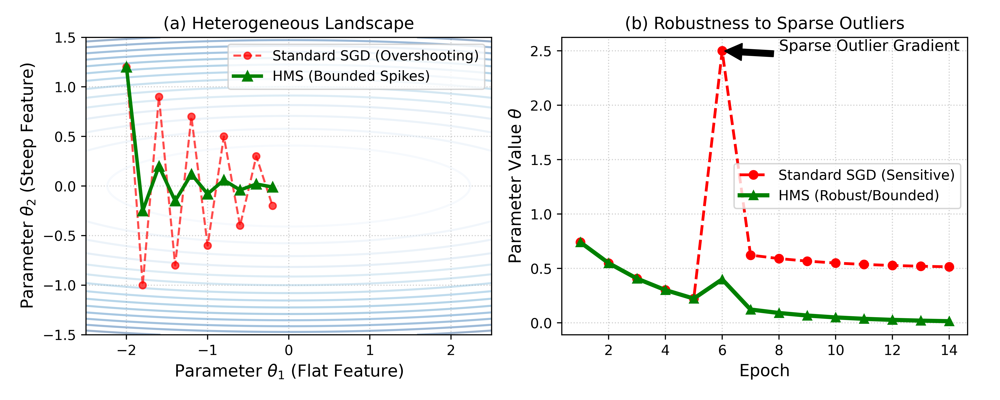

# ⚡ HMS — Harmonic Mean Scalar Optimizer

> A novel epoch-based weight adjustment technique that accelerates convergence and improves regression performance — compatible with any SGD-based PyTorch optimizer.

[](https://www.python.org/downloads/)
[](https://pytorch.org/)
[](https://opensource.org/licenses/MIT)
[]()
[]()

---

## Table of Contents

- [Overview](#overview)
- [Key Innovation](#key-innovation)
- [HMS Algorithm](#hms-algorithm)
- [HMS Optimizer API](#hms-optimizer-api)
- [Implemented Optimizers](#implemented-optimizers)
- [Quick Start](#quick-start)
- [Hyperparameters](#hyperparameters)
- [Key Properties](#key-properties)

---

## Overview

**HMS (Harmonic Mean Scalar)** is a novel post-epoch weight adjustment method designed to enhance classical SGD-based optimizers for regression tasks. Rather than modifying gradients, HMS adjusts model parameters **after each training epoch** using the harmonic mean of consecutive parameter values — a statistic known for its robustness to outliers.

<p align="center">
  
  <br/>
  <em>Figure 1: HMS applied as a post-epoch add-on to standard PyTorch optimizers.</em>
</p>

---

## Key Innovation

HMS calculates the **harmonic mean** of each parameter's previous and current epoch value, extracts the fractional displacement, scales it, and applies it as a corrective nudge to the current parameter. This simple but effective mechanism:

| Property | Description |
|---|---|
| 🚀 **Accelerates convergence** | Consistently faster than classical optimizers on regression benchmarks |
| 🛡️ **Outlier-resistant** | Harmonic mean is naturally robust to extreme values |
| 📉 **Stabilises training** | Smooth, monotone adjustments avoid oscillation |
| 🔌 **Plug-and-play** | Wraps any existing SGD-based optimizer — zero architecture changes |
| 🎛️ **Gradient-safe** | Does not modify gradients or break optimizer invariants |

<p align="center">
  
  <br/>
  <em>Figure 2: Convergence comparison — HMS vs. classical optimizers on regression tasks.</em>
</p>

---

## HMS Algorithm

HMS is applied **once per epoch** after the standard optimizer step. For each model parameter:

```
Given:  v1 = parameter value at previous epoch
        v2 = parameter value at current epoch
        r  = HMS scaling factor

Step 1 — Zero guard:
    if v1 == 0 or v2 == 0:  keep v2 unchanged

Step 2 — Compute harmonic mean:
    hm  = 2 × |v1| × |v2| / (|v1| + |v2|)

Step 3 — Compute scalar adjustment:
    hms = |hm − min(|v1|, |v2|)| × r

Step 4 — Apply directional update:
    if v1 > v2:   v2 = v2 − hms   (parameter decreased → push further down)
    if v1 < v2:   v2 = v2 + hms   (parameter increased → push further up)
    if v1 == v2:  no change

Step 5 — Decay r every t epochs:
    r = r × decay_rate
```

### Formal expression

$$\text{hm} = \frac{2 \cdot |v_1| \cdot |v_2|}{|v_1| + |v_2|}, \qquad \text{hms} = \bigl|\text{hm} - \min(|v_1|, |v_2|)\bigr| \cdot r$$

$$v_2 \leftarrow \begin{cases} v_2 - \text{hms} & \text{if } v_1 > v_2 \\ v_2 + \text{hms} & \text{if } v_1 < v_2 \\ v_2 & \text{if } v_1 = v_2 \end{cases}$$

---

## HMS Optimizer API

The `HMSOptimizer` class wraps any standard PyTorch optimizer:

```python
from harmonic_mean_scalar import HMSOptimizer

# Wrap your existing optimizer
base_optimizer = torch.optim.SGD(model.parameters(), lr=0.01)
optimizer = HMSOptimizer(model, base_optimizer, r=1.0, t=100, decay_rate=0.9)
```

### Class Definition

```python
class HMSOptimizer:
    def __init__(self, model, optimizer, r=1.0, t=100, decay_rate=0.9):
        """
        Args:
            model       : PyTorch model whose parameters are tracked
            optimizer   : Any SGD-based PyTorch optimizer
            r           : Initial HMS scaling factor         (default: 1.0)
            t           : Epoch interval for r decay         (default: 100)
            decay_rate  : Multiplicative decay applied to r  (default: 0.9)
        """

    def on_train_begin(self):
        """Initialise previous-epoch parameter snapshots."""

    def on_epoch_end(self):
        """Apply HMS adjustment after each epoch — call after optimizer.step()."""

    def apply_hms(self, v1, v2, r):
        """Core HMS scalar calculation for a single parameter value."""
```

### Training Loop Integration

```python
optimizer.on_train_begin()

for epoch in range(num_epochs):

    # — Standard training step —
    for batch in dataloader:
        outputs = model(batch)
        loss    = criterion(outputs, targets)
        base_optimizer.zero_grad()
        loss.backward()
        base_optimizer.step()

    # — Apply HMS after each epoch —
    optimizer.on_epoch_end()
```

---

## Implemented Optimizers

The repository implements the following algorithms alongside HMS:

| # | Algorithm | Module |
|---|---|---|
| 1 | **HMS** — Harmonic Mean Scalar *(this work)* | `HMS.py` |
| 2 | **ASAM** — Adaptive Sharpness-Aware Minimization | `ASAM.py` |
| 3 | **GP** — Geometric Perturbation | `GAP.py` |
| 4 | **HBF** — Heavy Ball with Friction | `HBF.py` |
| 5 | **Lookahead** — Lookahead Optimizer | `LAO.py` |
| 6 | **SM** — Slow Momentum | `SlowMo.py` |
| 7 | **SPS** — Stochastic Polyak Step Size | `SPS.py` |

---

## Quick Start

### Installation

```bash
pip install -r requirements.txt
```

### Minimal Example

```python
import torch
from harmonic_mean_scalar import HMSOptimizer

model     = MyRegressionModel()
criterion = torch.nn.MSELoss()

# Wrap any SGD-based optimizer with HMS
base_opt  = torch.optim.SGD(model.parameters(), lr=0.01, momentum=0.9)
hms_opt   = HMSOptimizer(model, base_opt, r=1.0, t=100, decay_rate=0.9)

hms_opt.on_train_begin()

for epoch in range(200):
    for X, y in dataloader:
        pred = model(X)
        loss = criterion(pred, y)
        base_opt.zero_grad()
        loss.backward()
        base_opt.step()
    hms_opt.on_epoch_end()   # ← HMS applied here
```

---

## Hyperparameters

| Parameter | Default | Description |
|---|---|---|
| `r` | `1.0` | Initial HMS scaling factor — controls adjustment magnitude |
| `t` | `100` | Epoch interval after which `r` is decayed |
| `decay_rate` | `0.9` | Multiplicative factor applied to `r` every `t` epochs |

**Decay schedule:** every `t` epochs → `r = r × decay_rate`

Reducing `r` over training allows large early adjustments that taper to fine-grained corrections as the model converges.

---

## Key Properties

| Property | Value |
|---|---|
| Applied at | End of each training epoch |
| Modifies gradients | ❌ No |
| Compatible with | Any SGD-based optimizer |
| Target task | Regression |
| Outlier resistance | ✅ Harmonic mean is robust to extremes |
| Overhead | Negligible — single pass over parameters per epoch |
